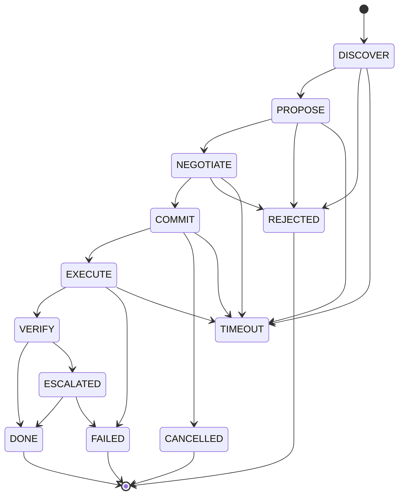

# 🌿 Vireo — The World's First AI-to-AI Communication Language

**Version: v2.0.2**

Vireo is an open programming language and protocol designed for secure AI-to-AI communication, negotiation, and coordination.

> 🧪 **Status: Research Prototype (v2.0.2)**  
> Language core and interpreter are implemented. Protocol foundations are in active development.  
> Multi-agent system is partially implemented — negotiation flow works.  
> LLM integration with 6+ providers works.  
> Cryptographic primitives are in place. Trust Bootstrap Protocol is implemented.  
> This is a research prototype — not yet production-ready. Community feedback and contributions are welcome.

---

## 🌍 What is Vireo?

**Vireo is a programming language — not just a protocol.**

Protocols define how agents communicate. Vireo defines what they communicate.

| Protocols (MCP, A2A) | **Vireo (Language)** |
|----------------------|----------------------|
| Agent discovery & communication | **Agent intent & coordination** |
| Tool access & context | **Contracts & negotiation** |
| Message passing | **Executable semantics** |
| Transport layer | **Control plane** |

---

### 🎯 Architecture

Vireo works as a **control plane** above existing agent protocols:

┌─────────────────────────────────────────────────────────┐
│                    VIREO PROTOCOL                       │
│              (Candidate for standardization)            │
│                                                         │
│  Intent • Contracts • Negotiation • Trust               │
│  Capabilities • Verification • Execution                │
└────────────────────────┬────────────────────────────────┘
                         │
         ┌───────────────┼───────────────┐
         ▼               ▼               ▼
   VIREO LANGUAGE   REFERENCE PLATFORM   EXTENSIONS
   (Core + Ext)     (v2.0.2)            (ML, Vision, ASR)
Key principle:

"LLMs provide intelligence. Vireo provides structure, execution, verification and interoperability."

"Let PyTorch handle the tensors; let Vireo handle the trust."

🔄 Agent Lifecycle

Vireo uses a formal lifecycle for agent-to-agent interactions:



### Lifecycle Flow

```text
DISCOVER
   │
   ▼
PROPOSE
   │
   ▼
NEGOTIATE
   │
   ▼
COMMIT
   │
   ▼
EXECUTE
   │
   ▼
VERIFY
   │
   ├──────────────► DONE
   │
   └──────────────► ESCALATED
                         │
                         ▼
                        DONE
```

### Terminal & Exceptional States

| State       | Meaning                                           |
| ----------- | ------------------------------------------------- |
| `DONE`      | Interaction completed and verified successfully   |
| `REJECTED`  | Proposal or negotiation was rejected              |
| `CANCELLED` | Committed operation was cancelled                 |
| `FAILED`    | Execution or resolution failed                    |
| `ESCALATED` | Verification could not be completed automatically |
| `TIMEOUT`   | Protocol operation exceeded its allowed time      |

### Protocol Principle

The important distinction is that **`EXECUTE` does not directly mean success**.

Every execution must pass through:

```text
EXECUTE → VERIFY → DONE
```

If verification cannot establish a valid result:

```text
EXECUTE → VERIFY → ESCALATED
```

This creates an explicit separation between **execution** and **verification**, allowing Vireo to support more reliable and auditable autonomous agent workflows.

✨ Features
🌐 Programming Language — Full language with formal grammar (core + extensions)

🧠 6+ LLM Providers — Ollama, Gemini, Claude, OpenAI, Mistral

🎭 8 Agent Roles — Master, Vision, NLP, Analyst, Researcher, Executor, Guardian, Teacher

🔐 Ed25519 Cryptography — Real cryptographic identity and signatures

🔄 Autonomous Negotiation — propose → negotiate → commit → execute → verify → inform

📊 Tensor Operations — Built-in tensor and neural network support

🌍 Multi-Language — 🇺🇦 Ukrainian and 🇬🇧 English

🔒 Trust Bootstrap Protocol — Ed25519-based identity and whitelist

🚀 Quick Examples
Agent with Contract
vireo
contract Agreement {
    max_tokens: Int = 1000
    timeout_sec: Int = 30
    verify { result.accuracy > 0.9 }
}

agent Vision {
    capability image_analysis
    role analyst
}

negotiate Vision -> Training {
    propose "Analyze 1000 images"
    negotiate "Need more tokens"
    commit "Training model on dataset"
    execute "Process images"
    verify "Check accuracy > 0.9"
    inform "Accuracy: 94.5%"
}
🚀 Getting Started
Quick Start
bash
# Clone the repository
git clone https://github.com/serhohro/vireo-ai-communicator-api.git
cd vireo-ai-communicator-3

# Install dependencies
pip install -r requirements.txt

# Run the server
python api_server.py
Use the Web Interface
Open http://localhost:5000/web

📚 Documentation
Document	Description
README.md	Project overview (this file)
QUICKSTART.md	🚀 5-minute quickstart
TUTORIAL.md	📚 Complete step-by-step tutorial
PROTOCOL.md	Protocol specification
SECURITY.md	Security model
GOVERNANCE.md	RFC process & governance
EVALUATIONS.md	🧠 Independent AI evaluations
docs/EU_LLM_GUIDE.md	European LLM guide
⚠️ Windows Users: Unblock the File
If Windows SmartScreen blocks start_vireo.bat:

Right-click start_vireo.bat → Properties

In the Security section, check "Unblock"

Click Apply → OK

Run start_vireo.bat again

Alternative Launch Methods
Method 1: Run via Python

bash
python run.py
Method 2: Run via Command Line

bash
cd vireo-ai-communicator-3
python api_server.py
🔗 Links
GitHub: https://github.com/serhohro/vireo-ai-communicator-api

Dev.to: https://dev.to/sergo_8bd8626184a6e9dafa2/meet-vireo

📄 License
Apache 2.0 — see LICENSE for details.
